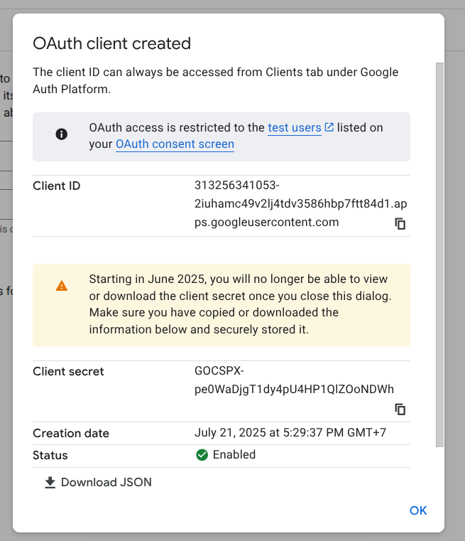

# Google Sheets ETL Automation Pipeline 📈
A Python-based ETL pipeline for consolidating data from multiple Google Sheets into a central data warehouse sheet. This project automates the process of merging, transforming, and loading data, featuring built-in support for Change Data Capture and Slowly Changing Dimension (SCD) Type 1 updates.

### 📋 Table of Contents
- [Overview](#-overview)
- [Features](#-features)
- [Pipeline Architecture](#-pipeline-architecture)
- [How It Works](#-how-it-works)
- [Project Structure](#-project-structure)
- [Prerequisites](#-prerequisites)
- [Setup & Installation](#-setup--installation)
- [Configuration](#-configuration)
- [Usage](#%EF%B8%8F-usage)

### 🔎 Overview
This project is designed to solve the common challenge of aggregating cleaned, but separate, datasets residing in Google Sheets. It provides a robust, re-runnable script that intelligently merges new and updated records into a master Google Sheet, which acts as a simple data warehouse. The core logic handles updates by overwriting existing records (SCD Type 1) and appends new records, ensuring the data warehouse stays current with minimal manual intervention.

### ✨ Features
- **Automated ETL**: Fully automates the Extract, Transform, and Load process.
- **Google API Integration**: Seamlessly connects to Google Sheets and Google Drive using their respective APIs.
- **Data Consolidation**: Merges data from multiple source Google Sheets into one destination sheet.
- **Change Data Capture (CDC)**: Automatically identifies and processes new rows from the source data.
- **SCD Type 1 Handling**: Updates existing records by overwriting them with the latest data, ensuring no historical versions are kept.
- **Idempotent Design**: The script can be run multiple times without causing data duplication or errors. Anyone can run it to fetch the latest updates.
### 📄 Pipeline Architecture


### ⚙️ How It Works
The ETL process follows these logical steps:
1. **Extract**: The script authenticates with the Google API and reads all data from the specified source Google Sheets into Pandas DataFrames.
2. **Transform**: It merges these DataFrames into a single, consolidated DataFrame.
3. **Load & Update Logic**:
   - The script fetches the current data from the destination "Data Warehouse" sheet.
   - It uses a **primary key** (e.g., an 'ID' column) to differentiate records.
   - **For New Data (CDC)**: Any row from the source data whose primary key does not exist in the warehouse is identified as a new record and is appended to the warehouse.
   - **For Existing Data (SCD Type 1)**: Any row from the source data whose primary key already exists in the warehouse is identified as an update. The script then overwrites the existing row in the warehouse with the new data.
4. **Final Load**: The updated DataFrame (containing both new and modified rows) is written back to the destination Google Sheet.

### 📁 Project Structure
```bash
nusadata-etl-script/
├── credentials.json
├── etl_notebook.ipynb
├── main.py
├── requirements.txt
└── settings.py
```

### 🔧 Prerequisites
- Python 3.11
- A Google Cloud Platform (GCP) project.
- Enabled Google Drive API and Google Sheets API in your GCP project.
- A OAuth 2.0 Client ID with credentials (JSON key file).
  
### 🚀 Setup & Installation
1. **Clone the Repository:**
   ```bash
   git clone https://github.com/Tegarr123/nusadata-etl-script.git
   cd nusadata-etl-script
   ```
2. **Set Up a Virtual Environment (Recommended):**
   ```bash
   python -m venv venv
   source venv/bin/activate  # On Windows, use `venv\Scripts\activate`
   ```
3. **Install Dependencies:**
   ```bash
   pip install -r requirements.txt
   ```
4. **Google API Credentials (OAuth 2.0):**
   - Go to your [Google Cloud Console](https://console.cloud.google.com/).
   - Create a new project (or use an existing one).
   - Enable the **Google Drive API** and **Google Sheets API**.
    
   - Go to "APIs & Services" → "Credentials."
   - Click "+ CREATE CREDENTIALS" and select "**OAuth client ID.**"
   - If prompted, configure the "**OAuth consent screen.**" For a personal project, you can choose "**External**" user type and fill in the required app name and email fields.
   <br> <br>
   - For the "Application type," select "**Desktop app.**"
   <br><br>
   - After creation, a window will pop up. Click "**DOWNLOAD JSON**" to get your credentials file.
   <br><br>
   - Rename the downloaded file to ```credentials.json``` and place it in the root directory of this project.
   
### 🔩 Configuration
Before running the script, rename ```settings.py.example``` to ```settings.py``` and then update with your specific information
```bash
MASTER_INCOME_PROVINCE_SPSID="[spreadsheet_id]"
MASTER_INDICATOR_SPSID="[spreadsheet_id]"
MASTER_AREA_SPSID="[spreadsheet_id]"
MASTER_YEAR_SPSID="[spreadsheet_id]"

MASTER_WORKSHEET="main"
CLEANED_DATA_DRIVE_FOLDER="[drive_folder_id]"
SCOPES=["https://www.googleapis.com/auth/drive","https://www.googleapis.com/auth/spreadsheets"]
WAREHOUSE_DATA_SPS_ID="[spreadsheet_id]"
```
- ```MASTER_INCOME_PROVINCE_SPSID``` : spreadsheet id for master data of province income
- ```MASTER_INDICATOR_SPSID``` : spreadsheet id for master data of digital indicator in indonesia
- ```MASTER_AREA_SPSID``` : spreadsheet id for master data of area/location in indonesia
- ```MASTER_YEAR``` : spreadsheet id for master data of Year (time) in indonesia
- ```MASTER_WORKSHEET``` : worksheet id for master all of the master data (worksheet name should be the same)
- ```CLEANED_DATA_DRIVE_FOLDER``` : google drive folder id containing all of cleaned data sources
- ```SCOPES``` : scope for utilizing google API service (by default is provided)
- ```WAREHOUSE_DATA_SPS_ID``` : destination spreadsheet id for storing data warehouse
<br>

**drive folder id**<br>

<br>

**Spreadsheet id and Worksheet Name**<br>

<br>

### ▶️ Usage
To run the full ETL process, simply execute the main Python script from your terminal:
```bash
python main.py
```
**First-Time Authorization**<br>
The **very first time you run the script**, it will do the following:
1. Automatically open a new tab in your web browser.
2. Ask you to log in to your Google Account.
3. Ask you to grant permission for the script to access your Google Sheets.

After you approve, a ```token.json``` file will be created in your project directory. This file securely stores your authorization tokens so you won't have to log in again on subsequent runs.

The script will print progress updates to the console, such as the number of new rows added and existing rows updated.
For a more interactive experience or for debugging, you can use the ```etl_notebook.ipynb``` in a Jupyter environment.
